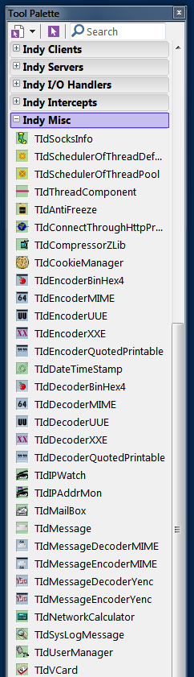
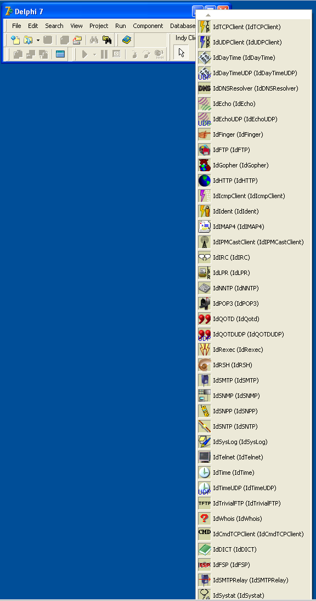

# What is this?

Indy Direct is a complex networking component pack for Delphi and Lazarus programming enviroment,
 written in Pascal language.  
  
Delphi comes with it by default, but you should upgrade it, to get latest fixes.  
  
# DLLs:
  
The necessary binary DLL files can be [downloaded from here...](https://github.com/IndySockets/OpenSSL-Binaries)  
 _(Each code version of code needs a specific version of the DLL files.)_  
 
```text
/* ********************************************************** */  
/* TODO: add more details about: how to pick the right DLL... */  
```
 
# Install  
  
Auto-installer BAT files are in the **Lib** directory.  
  
There is a new version 1.1.1 too, but currently under development.  
Many reported it is stable enough.  
You may download the source [from here.](https://github.com/IndySockets/Indy/pull/299)  
  
# Help / Documents:

The best way to learn about Indy is to look into the .pas files, or run debugging step by step.
There is also an old .HLP file under /Help directory for old mashines, like XP + Delphi7.

# Screenshots:

Here is a picture about some "Misc" components under Delphi-XE8:  

  
And here is a picture about old Delphi-7 and the basic Indy components:  


